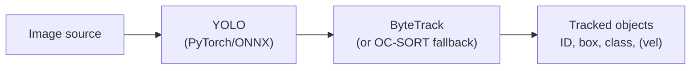

# Embedded-ready Multi-Object Tracking Pipeline for Robotics

Gaining experience with
- ROS2 middleware
- PyTorch/ONNX/TensorRT

## Hypothesis
> “A minimal YOLOv8-N/YOLO11-N + ByteTrack pipeline can be instrumented as three clean ROS2 nodes with correct sensor-time stamp propagation and bounded queues, delivering measurable end-to-end latency, tracking quality, and resource numbers on a PC that will decide whether a later Jetson deployment is justified.”

## Language choice

- Python (`rclpy`) for the entire Phase 1.
- C++ rewrite of the hot path is explicitly deferred (optional later exercise).

## TODO