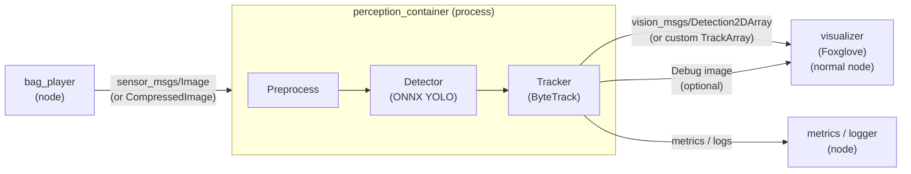

# Architecture



Metrics node: Publishes or logs end-to-end latency, drop rates, track count, Timers, `/diagnostics`, parameters


### Hypothesis
> “A minimal YOLOv8-N/YOLO11-N + ByteTrack pipeline can be instrumented as ROS2 components with correct sensor-time stamp propagation and bounded queues, delivering measurable end-to-end latency, tracking quality, and resource numbers on a PC that will decide whether a later Jetson deployment is justified.”

### 🚧 Folder Structure

```
README.md
docs/
  architecture.md
  results.md
  reproducibility.md
configs/
scripts/
  run_offline_baseline.py
  ...
src/
  detector/
  tracker/
  ros2_nodes/
results/
  tables/
  figures/
```
