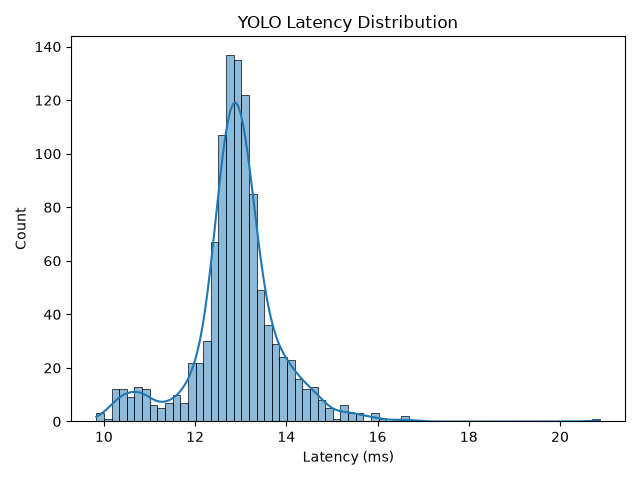
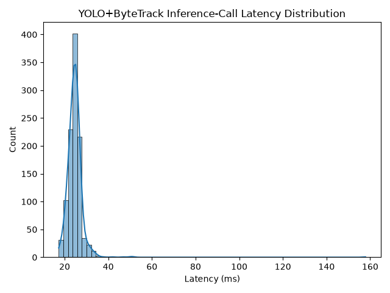

# Reproducibility

| Component | Choice | Reasons |
|---| ---|---|
| **Dataset** | KITTI Tracking: 0007, 0019 | Complementary # cars and peds |
| **Detector** | YOLO11-N | Better detection accuracy for smaller or overlapping objects |
| **Tracker** | ByteTrack | Very fast: it's only associator + KF|

- One annotated sequence for metrics: KITTI Tracking.
- One ROS-compatible source: a public ROS bag or a short self-recorded sequence (plan the recording this week if none exists).

## Dataset
KITTI Multi-Object Tracking sequences

```
Data Format Description
=======================

The data for training and testing can be found in the corresponding folders.
The sub-folders are structured as follows:

  - image_02/%04d/ contains the left color camera sequence images (png)
  - image_03/%04d/ contains the right color camera sequence images  (png)
  - label_02/ contains the left color camera label files (plain text files)
  - calib/ contains the calibration for all four cameras (plain text files)

The label files contain the following information. 
All values (numerical or strings) are separated via spaces, each row 
corresponds to one object. The 17 columns represent:

#Values    Name      Description
----------------------------------------------------------------------------
   1    frame        Frame within the sequence where the object appearers
   1    track id     Unique tracking id of this object within this sequence
   1    type         Describes the type of object: 'Car', 'Van', 'Truck',
                     'Pedestrian', 'Person_sitting', 'Cyclist', 'Tram',
                     'Misc' or 'DontCare'
   1    truncated    Integer (0,1,2) indicating the level of truncation.
                     Note that this is in contrast to the object detection
                     benchmark where truncation is a float in [0,1].
   1    occluded     Integer (0,1,2,3) indicating occlusion state:
                     0 = fully visible, 1 = partly occluded
                     2 = largely occluded, 3 = unknown
   1    alpha        Observation angle of object, ranging [-pi..pi]
   4    bbox         2D bounding box of object in the image (0-based index):
                     contains left, top, right, bottom pixel coordinates
   3    dimensions   3D object dimensions: height, width, length (in meters)
   3    location     3D object location x,y,z in camera coordinates (in meters)
   1    rotation_y   Rotation ry around Y-axis in camera coordinates [-pi..pi]
   1    score        Only for results: Float, indicating confidence in
                     detection, needed for p/r curves, higher is better.
```


I chose the following eval sequences
- 0007
    - mostly cars, vans, trucks, few peds
- 0019
    - mostly peds (crowded area), few cars, longest

by Running analysis script

`uv run scripts/kitti_label_stats.py data/kitti/left_color/training/label_02`

and inspecting the table showing object type counts across frames. Choosing sequences that are somewhat complementary in the number of `Pedestrian` / `Person`/ `Cyclist` and `Car`/`Van`/`Truck`.

| Sequence | Length | Car | Cyclist | DontCare | Misc | Pedestrian | Person | Tram | Truck | Van | Objects Total |
|---|---:|---:|---:|---:|---:|---:|---:|---:|---:|---:|---:|
| 0000 | 154 | 243 | 154 | 378 | 0 | 22 | 0 | 0 | 0 | 292 | 1089 |
| 0001 | 447 | 2681 | 0 | 1241 | 20 | 112 | 0 | 0 | 77 | 140 | 4271 |
| 0002 | 233 | 1032 | 75 | 601 | 16 | 180 | 0 | 0 | 84 | 110 | 2098 |
| 0003 | 144 | 363 | 0 | 473 | 0 | 0 | 0 | 0 | 0 | 25 | 861 |
| 0004 | 314 | 818 | 60 | 899 | 0 | 65 | 0 | 51 | 27 | 92 | 2012 |
| 0005 | 297 | 1275 | 139 | 672 | 0 | 0 | 0 | 0 | 30 | 32 | 2148 |
| 0006 | 270 | 550 | 0 | 684 | 0 | 0 | 0 | 0 | 101 | 111 | 1446 |
| 0007 | 800 | 2258 | 0 | 988 | 121 | 67 | 0 | 0 | 58 | 230 | 3722 |
| 0008 | 390 | 1046 | 0 | 717 | 2 | 0 | 0 | 0 | 30 | 293 | 2088 |
| 0009 | 803 | 2859 | 0 | 1525 | 0 | 29 | 0 | 0 | 612 | 276 | 5301 |
| 0010 | 294 | 603 | 14 | 395 | 59 | 30 | 0 | 127 | 25 | 70 | 1323 |
| 0011 | 373 | 3405 | 0 | 571 | 0 | 201 | 0 | 0 | 0 | 182 | 4359 |
| 0012 | 78 | 144 | 41 | 105 | 0 | 64 | 0 | 0 | 0 | 0 | 354 |
| **0013** | 340 | 55 | 237 | 935 | 18 | 929 | 167 | 0 | 0 | 69 | 2410 |
| 0014 | 106 | 455 | 0 | 149 | 0 | 122 | 0 | 0 | 0 | 72 | 798 |
| 0015 | 376 | 899 | 537 | 1282 | 25 | 752 | 0 | 0 | 0 | 0 | 3495 |
| 0016 | 209 | 836 | 272 | 1010 | 0 | 2027 | 0 | 0 | 0 | 0 | 4145 |
| 0017 | 145 | 0 | 101 | 616 | 0 | 782 | 0 | 0 | 0 | 0 | 1499 |
| 0018 | 339 | 1354 | 0 | 381 | 0 | 0 | 0 | 0 | 0 | 59 | 1794 |
| **0019** | 1059 | 927 | 308 | 2366 | 91 | 6088 | 509 | 417 | 0 | 486 | 11192 |
| 0020 | 837 | 5497 | 0 | 2051 | 441 | 0 | 0 | 0 | 145 | 762 | 8896 |


Class Remapping Table
| KITTI class | YOLO11-n (COCO) class(es) | Recommendation for Phase 1 |
|---|---|---|
| Car | car | Keep (direct) |
| Van | car (or truck) | Map to Car |
| Truck | truck | Keep or map to Car |
| Pedestrian | person | Keep (direct) |
| Person_sitting | person | Map to Pedestrian |
| Cyclist | person + bicycle | Usually treat as Pedestrian (or ignore) |
| Tram | train / bus | Optional / ignore |
| Misc / DontCare | — | Discard |


## Latency

### Detector: YOLO11-n
Reproduce with
```shell
uv run scripts/latency_bench.py --kitti-seq path/to/downloaded/kitti/left_color/training/image_02/0019
```
Numbers should be similar. Exactly the same numbers impossible due to varying CPU/GPU load.

Using image resolution `(352, 1216)` as that's the closest multiple of `32` to the original `(375, 1242)`, required by the YOLO11-N detector.

**Results**

| Metric | Value |
|---|---|
| Device | nVidia RTX3090 24GB VRAM  |
| Dataset | KITTI Tracking 0019  |
| Input resolution | (352, 1216)  |
| Frames | 1059  |
| Median Latency | 12.91 ms |
| P95 Latency | 14.43 ms |
| GPU Peak Memory | 82.03 MB |

<p align="center">
  
</p>

### Tracker: ByteTrack
Reproduce with
```shell
uv run scripts/latency_bench.py --kitti-seq path/to/downloaded/kitti/left_color/training/image_02/0019 --tracker
```

Measuring YOLO + ByteTrack inference-call latency.

**Results**

| Metric | Value |
|---|---|
| Device | nVidia RTX3090 24GB VRAM  |
| Dataset | KITTI Tracking 0019  |
| Input resolution | (352, 1216)  |
| Frames | 1059  |
| Median Latency | 28.28 ms |
| P95 Latency | 33.16 ms |
| GPU Peak Memory | 86.63 MB |

<p align="center">
  
</p>


## MOT Metrics

### TrackEval Dataset Config

```python
dataset_config = {
    "GT_FOLDER": "data/kitti/left_color/training",
    # Tracker predictions in a text file in KITTI format
    "TRACKERS_FOLDER": "data/kitti/trackers", 
    "TRACKERS_TO_EVAL": ["bytetrack"],
    "SPLIT_TO_EVAL": "training",
    "CLASSES_TO_EVAL": ["car", "pedestrian"],
}
```
The ByteTrack predictions for sequence 0019 should be placed in 

```
data/kitti/trackers/bytetrack/data/0019.txt
```
Create `.seqmap` file under `{GT_FOLDER}/evaluate_tracking.seqmap.training` with file contents
```
0019 {GT_FOLDER}/image_02/0019 000000 001059
```
indicating sequence number, path, start frame, sequence length. 
Replace `{GT_FOLDER}` in the path specs with whatever it's set to in the `dataset_config`.


Running this will produce the prediction for sequence `0019`

```shell
uv run scripts/mot_bench.py --kitti-seq data/kitti/left_color/training/image_02/0019
```

Compute TrackEval MOT metrics with
```shell
uv run scripts/mot_trackeval.py  
```

### Baseline
Evaluated on sequence `0019` only. For now!

Achieved results are as follows:
```
Evaluating bytetrack

1 eval_sequence(0019, bytetrack)                                         0.7266 sec

All sequences for bytetrack finished in 0.73 seconds

HOTA: bytetrack-car                HOTA      DetA      AssA      DetRe     DetPr     AssRe     AssPr     LocA      OWTA      HOTA(0)   LocA(0)   HOTALocA(0)
0019                               49.423    52.537    46.825    62.342    64.794    49.148    77.658    78.67     53.955    66.096    73.79     48.773    
COMBINED                           49.423    52.537    46.825    62.342    64.794    49.148    77.658    78.67     53.955    66.096    73.79     48.773    

CLEAR: bytetrack-car               MOTA      MOTP      MODA      CLR_Re    CLR_Pr    MTR       PTR       MLR       sMOTA     CLR_TP    CLR_FN    CLR_FP    IDSW      MT        PT        ML        Frag      
0019                               60.562    75.468    62.271    79.243    82.36     50        50        0         41.121    649       170       139       14        3         3         0         10        
COMBINED                           60.562    75.468    62.271    79.243    82.36     50        50        0         41.121    649       170       139       14        3         3         0         10        

Identity: bytetrack-car            IDF1      IDR       IDP       IDTP      IDFN      IDFP      
0019                               63.348    62.149    64.594    509       310       279       
COMBINED                           63.348    62.149    64.594    509       310       279       

Count: bytetrack-car               Dets      GT_Dets   IDs       GT_IDs    
0019                               788       819       27        6         
COMBINED                           788       819       27        6         

HOTA: bytetrack-pedestrian         HOTA      DetA      AssA      DetRe     DetPr     AssRe     AssPr     LocA      OWTA      HOTA(0)   LocA(0)   HOTALocA(0)
0019                               39.351    42.823    36.533    50.037    58.04     41.609    61.603    72.887    42.693    61.861    63.982    39.58     
COMBINED                           39.351    42.823    36.533    50.037    58.04     41.609    61.603    72.887    42.693    61.861    63.982    39.58     

CLEAR: bytetrack-pedestrian        MOTA      MOTP      MODA      CLR_Re    CLR_Pr    MTR       PTR       MLR       sMOTA     CLR_TP    CLR_FN    CLR_FP    IDSW      MT        PT        ML        Frag      
0019                               46.561    67.89     48.247    67.228    77.982    25.806    69.355    4.8387    24.974    3949      1925      1115      99        16        43        3         244       
COMBINED                           46.561    67.89     48.247    67.228    77.982    25.806    69.355    4.8387    24.974    3949      1925      1115      99        16        43        3         244       

Identity: bytetrack-pedestrian     IDF1      IDR       IDP       IDTP      IDFN      IDFP      
0019                               56.519    52.622    61.039    3091      2783      1973      
COMBINED                           56.519    52.622    61.039    3091      2783      1973      

Count: bytetrack-pedestrian        Dets      GT_Dets   IDs       GT_IDs    
0019                               5064      5874      176       62        
COMBINED                           5064      5874      176       62
```

with the following TrackEval config summary:
```
Kitti2DBox Config:
GT_FOLDER            : data/kitti/left_color/training
TRACKERS_FOLDER      : data/kitti/trackers           
TRACKERS_TO_EVAL     : ['bytetrack']                 
SPLIT_TO_EVAL        : training                      
CLASSES_TO_EVAL      : ['car', 'pedestrian']         
OUTPUT_FOLDER        :                               
INPUT_AS_ZIP         : False                         
PRINT_CONFIG         : True                          
TRACKER_SUB_FOLDER   : data                          
OUTPUT_SUB_FOLDER    :                               
TRACKER_DISPLAY_NAMES : None                          
Reading from seqmap_file='data/kitti/left_color/training/evaluate_tracking.seqmap.training'...

CLEAR Config:
THRESHOLD            : 0.5                           
PRINT_CONFIG         : True                          

Identity Config:
THRESHOLD            : 0.5                           
PRINT_CONFIG         : True                          

Eval Config:
USE_PARALLEL         : False                         
PRINT_RESULTS        : True                          
OUTPUT_SUMMARY       : True                          
NUM_PARALLEL_CORES   : 8                             
BREAK_ON_ERROR       : True                          
RETURN_ON_ERROR      : False                         
LOG_ON_ERROR         : /home/jacob/ros2-mot-pipeline/.venv/lib/python3.14/site-packages/error_log.txt
PRINT_ONLY_COMBINED  : False                         
PRINT_CONFIG         : True                          
TIME_PROGRESS        : True                          
DISPLAY_LESS_PROGRESS : True                          
OUTPUT_EMPTY_CLASSES : True                          
OUTPUT_DETAILED      : True                          
PLOT_CURVES          : True                          

Evaluating 1 tracker(s) on 1 sequence(s) for 2 class(es) on Kitti2DBox dataset using the following metrics: HOTA, CLEAR, Identity, Count
```


## ONNX Export

```shell
uv run yolo detect export model=yolo11n.pt format=onnx imgsz=352,1216
```

```shell
ONNX: starting export with onnx 1.23.2 opset 18...
ONNX: slimming with onnxslim 0.1.97...
ONNX: export success ✅ 7.4s, saved as 'yolo11n.onnx' (10.3 MB)

Export complete (7.9s)
Results saved to /home/jacob/ros2-mot-pipeline/yolo11n.onnx
Predict:         yolo predict task=detect model=yolo11n.onnx imgsz=352,1216 
Validate:        yolo val task=detect model=yolo11n.onnx imgsz=352,1216   WARNING ⚠️ non-PyTorch val requires square images, 'imgsz=[352, 1216]' will not work. Use export 'imgsz=1216' if val is required.
Visualize:       https://netron.app
```